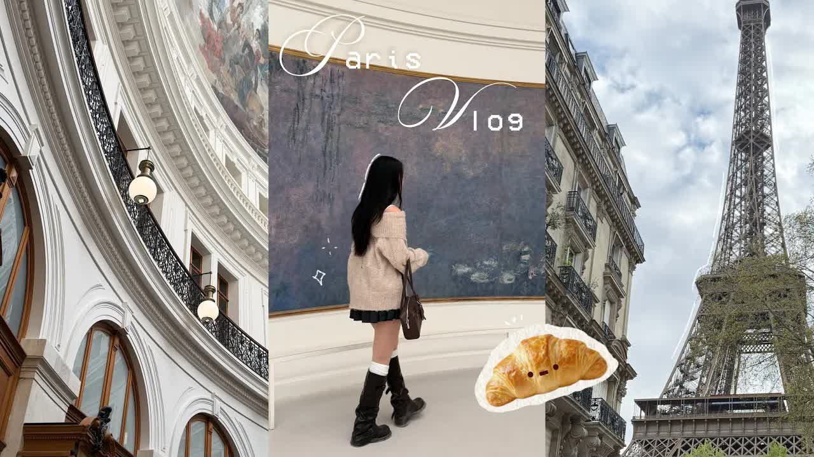

# Paris-vlog-🥐：-exploring-the-city,-art-museums,-pretty-architectures,-cute-cafes,-yummy-food-✶

  <picture>
    
  </picture>

 

---

## Video Information

| Property | Value |
|----------|-------|
| **Video Name** | `Paris-vlog-🥐：-exploring-the-city,-art-museums,-pretty-architectures,-cute-cafes,-yummy-food-✶` |
| **Original Link** | [YouTube Video](https://www.youtube.com/watch?v=LPj9YU0LOsk) |
| **Total Size** | **5 parts** - **194.03 MB** |
| **Quality** | **720** |
| **Status** | **Complete (100%)** |
| **Password Protected** | **NO** |

---

---

## 🔤 Subtitles

| # | File | Link |
|---|------|------|
| 1 | `subtitle.zip` | [Download](https://raw.githubusercontent.com/mahliolio/Ourtube/main/videos/Paris-vlog-%F0%9F%A5%90%EF%BC%9A-exploring-the-city%2C-art-museums%2C-pretty-architectures%2C-cute-cafes%2C-yummy-food-%E2%9C%B6/subtitle.zip) |

> Contains all available subtitle languages. Extract to get `.vtt` files.

## Download Links

> ⬇️ Download **all parts**, then open `Paris-vlog-🥐：-exploring-the-city,-art-museums,-pretty-architectures,-cute-cafes,-yummy-food-✶.zip` — the other parts are found automatically.

| # | File | Link |
|---|------|------|
| 1 | `Paris-vlog-🥐：-exploring-the-city,-art-museums,-pretty-architectures,-cute-cafes,-yummy-food-✶.z01` | [Download](https://raw.githubusercontent.com/mahliolio/Ourtube/main/videos/Paris-vlog-%F0%9F%A5%90%EF%BC%9A-exploring-the-city%2C-art-museums%2C-pretty-architectures%2C-cute-cafes%2C-yummy-food-%E2%9C%B6/Paris-vlog-%F0%9F%A5%90%EF%BC%9A-exploring-the-city%2C-art-museums%2C-pretty-architectures%2C-cute-cafes%2C-yummy-food-%E2%9C%B6.z01) |
| 2 | `Paris-vlog-🥐：-exploring-the-city,-art-museums,-pretty-architectures,-cute-cafes,-yummy-food-✶.z02` | [Download](https://raw.githubusercontent.com/mahliolio/Ourtube/main/videos/Paris-vlog-%F0%9F%A5%90%EF%BC%9A-exploring-the-city%2C-art-museums%2C-pretty-architectures%2C-cute-cafes%2C-yummy-food-%E2%9C%B6/Paris-vlog-%F0%9F%A5%90%EF%BC%9A-exploring-the-city%2C-art-museums%2C-pretty-architectures%2C-cute-cafes%2C-yummy-food-%E2%9C%B6.z02) |
| 3 | `Paris-vlog-🥐：-exploring-the-city,-art-museums,-pretty-architectures,-cute-cafes,-yummy-food-✶.z03` | [Download](https://raw.githubusercontent.com/mahliolio/Ourtube/main/videos/Paris-vlog-%F0%9F%A5%90%EF%BC%9A-exploring-the-city%2C-art-museums%2C-pretty-architectures%2C-cute-cafes%2C-yummy-food-%E2%9C%B6/Paris-vlog-%F0%9F%A5%90%EF%BC%9A-exploring-the-city%2C-art-museums%2C-pretty-architectures%2C-cute-cafes%2C-yummy-food-%E2%9C%B6.z03) |
| 4 | `Paris-vlog-🥐：-exploring-the-city,-art-museums,-pretty-architectures,-cute-cafes,-yummy-food-✶.z04` | [Download](https://raw.githubusercontent.com/mahliolio/Ourtube/main/videos/Paris-vlog-%F0%9F%A5%90%EF%BC%9A-exploring-the-city%2C-art-museums%2C-pretty-architectures%2C-cute-cafes%2C-yummy-food-%E2%9C%B6/Paris-vlog-%F0%9F%A5%90%EF%BC%9A-exploring-the-city%2C-art-museums%2C-pretty-architectures%2C-cute-cafes%2C-yummy-food-%E2%9C%B6.z04) |
| 5 | `Paris-vlog-🥐：-exploring-the-city,-art-museums,-pretty-architectures,-cute-cafes,-yummy-food-✶.zip` | [Download](https://raw.githubusercontent.com/mahliolio/Ourtube/main/videos/Paris-vlog-%F0%9F%A5%90%EF%BC%9A-exploring-the-city%2C-art-museums%2C-pretty-architectures%2C-cute-cafes%2C-yummy-food-%E2%9C%B6/Paris-vlog-%F0%9F%A5%90%EF%BC%9A-exploring-the-city%2C-art-museums%2C-pretty-architectures%2C-cute-cafes%2C-yummy-food-%E2%9C%B6.zip) |

---

## How to Extract

Download all parts into the **same folder**, then:

| OS | Steps |
|----|-------|
| **Windows** | Double-click `Paris-vlog-🥐：-exploring-the-city,-art-museums,-pretty-architectures,-cute-cafes,-yummy-food-✶.zip` — opens in Explorer, WinRAR, or 7-Zip automatically |
| **Mac** | Double-click `Paris-vlog-🥐：-exploring-the-city,-art-museums,-pretty-architectures,-cute-cafes,-yummy-food-✶.zip` — extracts with Archive Utility or The Unarchiver |
| **Linux** | `unzip Paris-vlog-🥐：-exploring-the-city,-art-museums,-pretty-architectures,-cute-cafes,-yummy-food-✶.zip` or right-click → Extract Here (Ark/File Manager) |
| **Android** | Tap `Paris-vlog-🥐：-exploring-the-city,-art-museums,-pretty-architectures,-cute-cafes,-yummy-food-✶.zip` in your file manager — or use [ZArchiver](https://play.google.com/store/apps/details?id=ru.zdevs.zarchiver) |

---

*This tool created by [avasam.ir](https://avasam.ir)*
